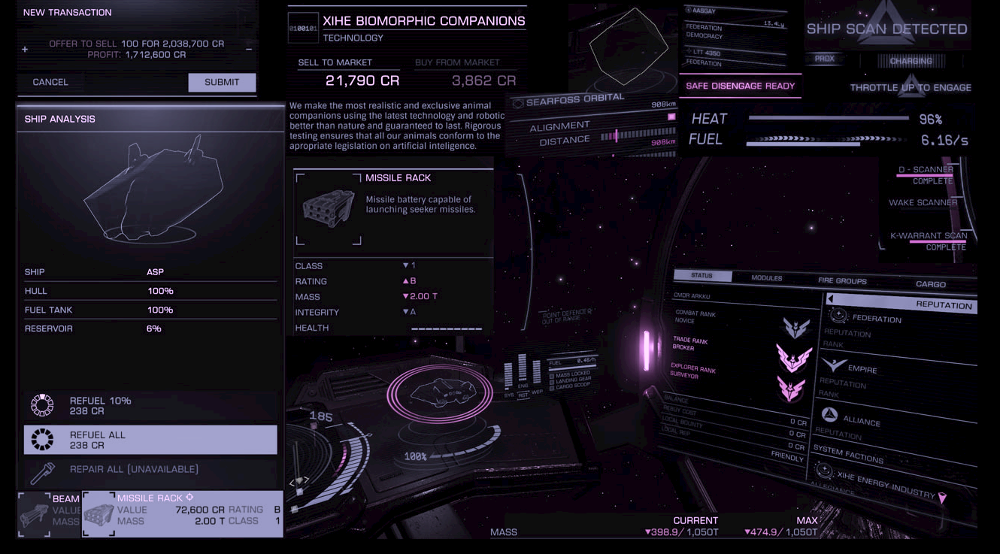
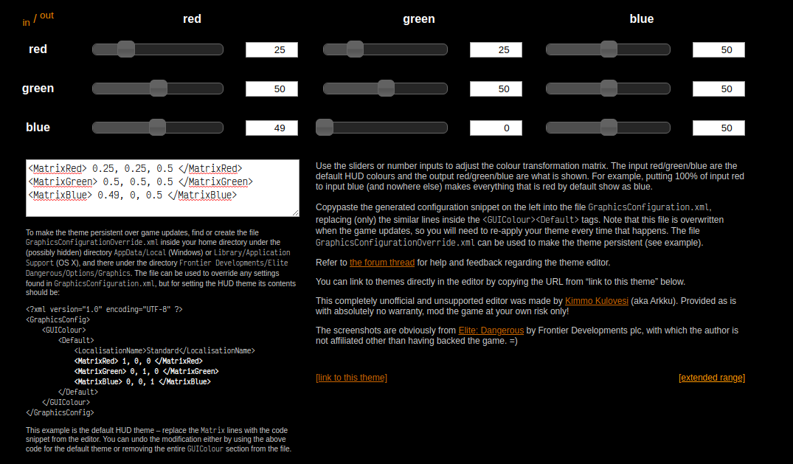

# elite-dangerous-hud-colors
[Elite: Dangerous](https://www.elitedangerous.com/) customized HUD Colors

## Files
[Products/elite-dangerous-64/GraphicsConfiguration.xml](Products/elite-dangerous-64/GraphicsConfiguration.xml)

## Intro

This repository keeps my HUD colors customization for the game Elite: Dangerous

## How to change

You must edit the file GraphicsConfiguration.xml and change this section:

```
<?xml version="1.0" encoding="UTF-8" ?>
<GraphicsConfig>
    <GUIColour>
        <Default>
            <LocalisationName>Standard</LocalisationName>
            <MatrixRed> 1, 0, 0 </MatrixRed>
            <MatrixGreen> 0, 1, 0 </MatrixGreen>
            <MatrixBlue> 0, 0, 1 </MatrixBlue>
        </Default>
    </GUIColour>
</GraphicsConfig>
```

`0` is the minimum value and `1` is the maximum. And you may use decimals like `0.25`, for example.


## References

[This site](http://arkku.com/elite/hud_editor/) helps you preview your customizations before you apply it on your file.





